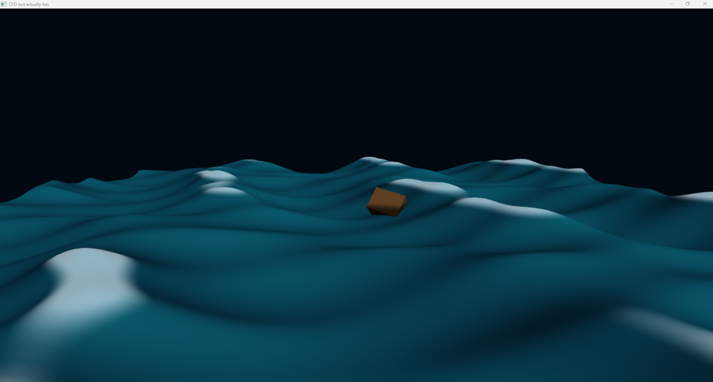

# CFD_but_actually_fun

A from-scratch DirectX 12 water-physics sandbox, inspired by (not affiliated
with) classic jet-ski racing games. Clean-room implementation: every line of
C++ and HLSL here is written from first principles.

The goal is to learn real water physics by building a playable ocean — waves,
buoyancy, rigid bodies, and eventually rideable craft with AI rivals — while
keeping it *actually fun* rather than academically correct.

  

*Milestone 5 stopping point: The local model's procedural jetski and IK-driven 
rider meet the Gerstner ocean. The rider's hips are low-pass filtered, causing 
the knees and elbows to compress and extend over the waves like real shock 
absorbers while the hands track the steering column.*

## Current status

| Milestone | State |
|---|---|
| 1 — Win32 window + D3D12 device, swap chain, fences | ✅ Done |
| 2 — Pipeline, vertex/index buffers, depth, water grid | ✅ Done |
| 3 — Animated sum-of-sines water, lighting, foam | ✅ Done |
| 4 — Gerstner waves + buoyant rigid body, fixed 120 Hz timestep | ✅ Done |
| 5 — Procedural jetski + rider (two-bone IK, wave absorption) | ✅ **You are here** |
| 6 — Wake field: moving bodies leave ripples | ⏳ Next |
| 7 — AI rivals that read steepness and wakes; race logic | ⏳ Planned |
| 8 — Modes: WaveLab, BuoyancySandbox, TimeTrial | ⏳ Planned |

## What is in the box (so far)

- **Renderer:** hand-rolled DirectX 12 — device, swap chain, RTV/DSV heaps,
  fence handshake, four PSOs (solid water, wireframe water, crate, jetski), and a
  56-float root-constant stream. No engine, no framework.
- **Water:** four Gerstner components with deep-water dispersion (ω = √(g·k)),
  steepness-budgeted horizontal displacement, analytic normals, crest foam,
  Blinn–Phong sun glint. A 129×129 grid (16,641 verts) re-simulated on the CPU
  every frame into a persistently-mapped upload buffer.
- **World-space water queries:** fixed-point inversion of the Gerstner
  horizontal shift, so physics can ask "how high is the water at (x, z)?" —
  the same sampler buoyancy calls every tick.
- **Floating bodies:** five sample points on the hull underside, each pushing
  up with ρ·g·V·w·(submerged fraction); per-sample drag; torques from lever
  arms; full 3D rotation via Euler's rigid-body equations in body space
  (gyroscopic ω × Iω term included), semi-implicit Euler at fixed 120 Hz.
- **Procedural Jetski & Rider:** A fully procedural, math-driven vehicle and 
  rider. The hull is lofted from cross-section stations; the rider is built 
  from primitive shapes skinned to a joint graph.
- **Inverse Kinematics (IK):** Analytic two-bone IK solver for arms and legs. 
  Hands track the steering column (which rotates with input), feet are planted 
  in the footwells.
- **Wave Absorption:** A low-pass filter on the rider's hips creates a natural 
  lag relative to the hull's vertical motion, causing the knees and elbows to 
  compress and extend over waves.
- **Debug tools:** F1 wireframe x-ray of the surface.

## Controls

| Key | Action |
|---|---|
| W / S | Throttle (accelerate / decelerate) |
| A / D | Steer left / right |
| F1 | Toggle water wireframe |
| R  | Re-drop the crate with a random tumble |

## Build & run

- Windows 10/11, Visual Studio 2022, "Desktop development with C++" workload.
- Open the solution, set **x64 / Debug**, run with **Ctrl+F5** from Visual
  Studio. The working directory must be the project folder: shaders are
  compiled at runtime from `water_vs.hlsl` / `water_ps.hlsl` on disk.
- **Close the game window before rebuilding.** A running executable locks its
  file and the link fails with LNK1168. Learned the hard way; documented so
  future-me doesn't have to.
- This snapshot is source-only; solution/project files live on the author's
  machine for now.

## Files

| File | Role |
|---|---|
| `main.cpp` | The whole C++ side: window, D3D12 bootstrap, wave field, rigid body, frame loop, and integration bridge |
| `water_vs.hlsl` | Vertex shaders: `main` (water), `mainModel` (crate), `mainJetski` (rider) |
| `water_ps.hlsl` | Pixel shaders: `
